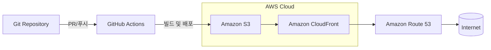
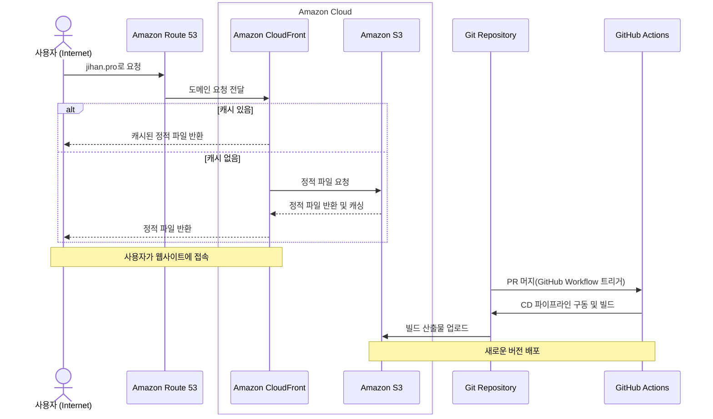
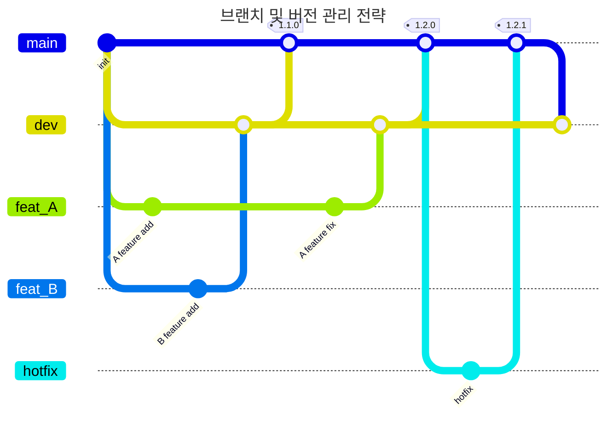

# Park Jihan Web Page

- [호스팅 URL: https://jihan.pro/](https://jihan.pro/)
- [S3 버킷 웹사이트 엔드포인트](http://jihan.pro.s3-website.ap-northeast-2.amazonaws.com)
- [CloudFrount 배포 도메인 이름](https://ddacqh4evk5n1.cloudfront.net)

## 개발환경

### 스크립트

- 패키지 설치

```bash
pnpm install
```

- 개발 환경 실행

```bash
pnpm dev
```

위 명령어로 default인 3000번 포트에 데브 서버를 열어줍니다. [http://localhost:3000](http://localhost:3000/)

- 정적 파일 생성(build)

```bash
pnpm build
```

- 테스트 실행

```bash
pnpm test
```

### 디렉토리 구조

```
.
├── README.md
├── __tests__ // 테스트 파일 디렉토리
├── .gtihub
│   └── workflows
│       ├── cd.workflow.yml // cd 자동화 스크립트
│       └── ci.workflow.yml // ci 스크립트
├── pnpm-lock.yaml // pnpm 의존성 정보
├── next-env.d.ts
├── next.config.mjs
├── package.json
├── postcss.config.mjs
├── public // 에셋 저장공간
│   ├── fonts // 폰트 디렉토리
│   ├── svgs // svg 디렉토리
│   └── images // 이미지 디렉토리
├── src
│   ├── components
│   ├── configs
│   ├── constants
│   ├── hooks
│   ├── utils
│   ├── types
│   ├── libs
│   └── app // Next App Router 기반 라우팅 디렉토리
├── vitest.config.ts // 테스트 환경설정 파일
├── tailwind.config.ts // 스타일 환경설정 파일
└── tsconfig.json // tsc 환경설정 파일

```

### 주요 개발 스택 및 패키지

| 패키지명 | 용도 | 참고사항 |
| --- | --- | --- |
| pnpm | 패키지 매니저 |  |
| NextJS | 프론트엔드 프레임워크 | 본 프로젝트는 npx create-next-app 명령어를 통해 생성되었습니다. |
| typescript | 개발 언어 |  |
| tailwindcss | 스타일 라이브러리 |  |
| eslint | 정적 코드 분석 도구 | 컨벤션 강제를 위한 린터 |
| vitest | 테스트 라이브러리 |  |
| axios | 비동기 통신 라이브러리 |  |

## 프로젝트 배포 환경

### 플로우 차트


### 시퀀스 다이어그램


### 사용자 요청 처리

사용자가 웹사이트에 접속할 때, `CloudFront는` 캐시된 파일을 제공하거나 `S3`에서 파일을 요청하여 반환합니다.

1. **`사용자` -> `Route 53`**: 사용자가 브라우저에서 `jihan.pro` 도메인으로 요청을 보냅니다.
2. **`Route 53` -> `CloudFront`**: `Route 53`은 `jihan.pro` 도메인의 DNS 요청을 받아서 해당 요청을 `CloudFront로` 전달합니다.
3. **`CloudFront` 캐시 확인**
    - `CloudFront`에 요청된 파일이 캐시되어 있는 경우, `CloudFront`는 캐시된 정적 파일을 사용자에게 반환합니다.
    - `CloudFront`에 요청된 파일이 캐시되어 있지 않은 경우, `CloudFront`는 `S3` 버킷에 정적 파일을 요청합니다.
        - **`S3` -> `CloudFront`**: `S3`는 요청된 정적 파일을 `CloudFront`로 반환합니다. 이때 `CloudFront`는 해당 파일을 캐시에 저장합니다.
4. **`CloudFront` -> `사용자`**: `CloudFront`가 정적 파일을 사용자에게 반환합니다.

### 코드 병합 및 배포

개발자가 코드 변경을 푸시하면, `GitHub Actions`가 빌드를 실행하고, 빌드 산출물을 `S3`에 업로드하여 새로운 버전을 배포합니다.

1. **`GitRepository` -> `GitHubActions`**: 개발자가 `GitRepository`에 `Pull Request (PR)`를 `main`에 머지하면 `Github Actions`의 `CD Workflow`가 트리거됩니다.
2. **`GitHubActions` -> `GitRepository`**: `GitHub Actions`는 `CD 파이프라인`을 실행하고, 빌드를 시작합니다.
3. **`GitRepository` -> `S3`**: 빌드가 완료되면 `GitHub Actions`는 빌드 산출물을 `S3` 버킷에 업로드합니다.

## 브랜치 관리 전략

본 프로젝트는 아래와 같은 브랜치 관리 전략을 채택합니다.



- 본 프로젝트의 브랜치 및 버전 관리 전략은 안정적인 신규 요구사항 반영, 기민한 장애 대응 등을 목적으로 하고 있습니다. 개인 프로젝트라는 특성에 따라 최대한 작은 개수의 브랜치 운영을 지향합니다.
- 본 프로젝트의 브랜치는 총 4개의 레이어로 분류됩니다.
    - `main`: 빌드가 이루어지는 default 브랜치입니다.
    - `dev`: 브랜치의 통합이 이루어지는 브랜치입니다. `feat` 브랜치의 base가 되므로 `main`과 `feat` 브랜치 사이에서 계속 싱크를 맞춰주는 역할을 합니다.
    - `feat`: 요구사항의 구현이 이루어지는 브랜치입니다. 항상 `dev`를 베이스로 합니다.
    - `hotfix`: 배포 이후의 장애 대응을 위해 `main`을 베이스로 하여 생성하고 작업한 이후에 직접 `main`에 병합합니다.
- 요구사항의 구현은 `feat`에서 이루어지며, `feat` 브랜치가 `dev`에 병합될 때마다 `main` 브랜치에서는 이를 병합받아 버전업을 합니다.
- 위 브랜치 관리 전략에 따라 CD 파이프라인이 동작하는 시점은 `main ← dev` 혹은 `main ← hotfix`의 PR이 생성된 시점부터로 합니다.

## Github Actions을 통한 CI/CD 파이프라인 자동화

- CI 워크플로우: `main` 브랜치에 `dev` 브랜치 혹은 `hotfix` 브랜치에서의 PR이 생성된 경우
    1. `dev` 브랜치 혹은 `hotfix` 브랜치에 체크아웃합니다.
    2. 프로젝트 의존성 패키지를 설치합니다.
    3. `vitest` 스크립트로 테스트를 실행합니다.
    4. `lint` 스크립트로 linter 설정을 적용합니다.
    5. `Next.js` 프로젝트 빌드를 통해 정적 파일을 생성합니다.
    6. `main` 브랜치에 체크아웃합니다.
    7. 해당 `PR`을 머지한 뒤, 머지 커밋을 푸쉬합니다.

- CD 워크플로우: `main` 브랜치에 새로운 `PR`이 머지될 경우
    1. `AWS 자격 증명`을 구성합니다.
    2. `main` 브랜치의 `out/` 디렉토리 내, 빌드된 정적 파일을 `S3 버킷`에 업로드합니다.
    3. `CloudFront` 캐시를 무효화하여 유저에게 새로운 버전이 제공될 수 있게 합니다.
    4. 버전 업 태그를 생성합니다.

## 배포관련 주요 개념에 대한 설명

### GitHub Actions와 CI/CD 도구

- **GitHub Actions**:
    - GitHub Actions는 GitHub의 CI/CD 플랫폼으로, 코드 저장소에 자동화된 작업을 정의하고 실행할 수 있습니다. 이 플랫폼을 사용하면 코드가 푸시되거나 PR(풀 리퀘스트)이 생성될 때 자동으로 빌드, 테스트, 배포 작업을 수행할 수 있습니다.
    - 워크플로우 파일(`.github/workflows/`)을 YAML 형식으로 작성하여 다양한 작업을 정의하고, GitHub의 이벤트(푸시, PR 등)에 따라 이 작업들을 자동으로 실행할 수 있습니다.
- **CI/CD 도구**:
    - **CI (Continuous Integration)**: 지속적인 통합을 의미하며, 개발자가 작성한 코드를 중앙 리포지토리로 통합할 때마다 자동으로 빌드 및 테스트를 수행하여 코드 품질을 유지합니다.
    - **CD (Continuous Delivery/Deployment)**: 지속적인 배포를 의미하며, CI 과정 후 자동으로 코드 배포를 준비하고 배포하는 프로세스를 포함합니다. Continuous Delivery는 배포 준비를 자동으로 하지만 실제 배포는 수동으로 진행할 수 있고, Continuous Deployment는 배포를 완전히 자동화합니다.

### AWS S3와 스토리지

- **AWS S3 (Simple Storage Service)**:
    - AWS S3는 객체 스토리지 서비스로, 대용량 데이터를 안전하게 저장하고 검색할 수 있는 서비스입니다. 파일과 데이터 객체를 버킷(bucket)이라는 논리적인 컨테이너에 저장합니다.
    - S3는 데이터의 내구성과 가용성을 보장하며, 정적 웹사이트 호스팅, 데이터 백업, 아카이빙, 분석 데이터 저장 등 다양한 용도로 사용됩니다.
    - **버킷**: S3에 저장되는 데이터의 컨테이너 역할을 하며, 각 버킷은 고유한 이름을 가지고 있습니다.

### AWS CloudFront와 CDN

- **CDN**:
    - CDN은 콘텐츠 전달 네트워크로, 웹 콘텐츠를 사용자에게 빠르고 신뢰성 있게 전달하기 위한 분산 서버 시스템입니다.
- **AWS CloudFront**:
    - CloudFront는 AWS의 콘텐츠 전송 네트워크(CDN) 서비스로, 정적 및 동적 웹 콘텐츠를 전 세계 사용자에게 빠르고 안전하게 배포할 수 있게 합니다.
    - 사용자의 요청을 지리적으로 가장 가까운 엣지 로케이션으로 라우팅하여 웹사이트 로딩 속도를 개선하고, 서버의 부하를 줄이는 역할을 합니다.
    - 캐싱 기능을 통해 자주 요청되는 콘텐츠를 엣지 로케이션에 저장하고, 요청이 있을 때 빠르게 제공하여 사용자 경험을 향상시킵니다.

### 캐시 무효화 (Cache Invalidation) 정책

- **캐시 무효화**:
    - 캐시 무효화는 CDN에서 캐시된 콘텐츠를 제거하여 새로운 콘텐츠로 교체하는 작업을 말합니다. 이는 콘텐츠가 업데이트되었을 때, 사용자에게 최신 버전을 제공하기 위해 필요합니다.
    - CloudFront에서는 캐시 무효화를 요청하여 특정 파일 또는 전체 디스트리뷰션의 캐시를 삭제할 수 있습니다. 무효화 요청은 비용이 발생할 수 있으며, 빈번한 캐시 무효화는 성능에 영향을 줄 수 있습니다.

### AWS Route 53과 DNS

- **DNS**:
    - DNS란 도메인 네임 시스템으로, 사람이 읽을 수 있는 도메인 이름을 컴퓨터가 인식할 수 있는 IP 주소로 변환하는 시스템입니다.
- **AWS Route 53**:
    - Route 53은 AWS의 DNS(도메인 네임 시스템) 웹 서비스로, 도메인 이름을 IP 주소로 변환하여 인터넷의 다양한 서비스에 접근할 수 있도록 합니다.
    - Route 53은 도메인 등록, DNS 라우팅, 트래픽 관리 기능을 제공합니다. 이를 통해 도메인 이름의 구입, 관리, DNS 레코드 설정 등을 쉽게 할 수 있습니다.

### Repository Secret과 환경변수

- **Repository Secret**:
    - GitHub에서 비밀 정보나 자격 증명을 안전하게 저장하고 관리하기 위해 사용하는 설정입니다. 예를 들어, API 키, 데이터베이스 비밀번호, 배포 자격 증명 등을 secret으로 저장하여 GitHub Actions에서 사용할 수 있습니다.
    - secret은 저장소의 설정에서 추가할 수 있으며, 워크플로우 파일에서는 `${{ secrets.SECRET_NAME }}` 형태로 참조할 수 있습니다.
- **환경변수**:
    - GitHub Actions에서는 `env` 키워드를 사용하여 환경변수를 설정하고 사용할 수 있습니다. 워크플로우 내에서 원하는 스코프에 따라 env를 관리할 수 있습니다.


## Archives

### Trouble Shooting
- `AWS Certification Manager`를 활용한 `CloudFront` `SSL` 인증서 셋팅
  - `https` 프로토콜 호출을 위해 `CloudFront`에 ACM을 활용한 `SSL` 인증서를 셋팅해줌.
  - 본 과정에서 `Route53` -> `S3`로 연결이 되어있어 jihan.pro에 접근 시 `CloudFront`가 아닌 `S3`에 접근하고 있었다는 것을 알았음.
  - `Route53` -> `CloudFront`로 A 타입 레코드의 origin을 변경하여 jihan.pro 접근시 `CloudFront`로 포워딩해줌. `CloudFront`에는 SSL 셋팅이 완료된 상태였으므로 jihan.pro 도메인에 https로 접근 가능.

- [미해결]정적 파일 라우팅 시에 pathname에 .html이 포함되어야 하는 문제
  - app router환경에서 `app/testpage`로 작성한 테스트페이지가 dev 환경에서는 `/testpage`로 접속했을 때 확인 가능한데, 정적 파일 배포한 환경에서는 `/testpage`로 접속이 불가하고, `/testpage.html`로 접속해야 확인이 가능한 문제
  - https://mingule.tistory.com/76 를 참고해서, `AWS Lambda`를 세팅하여 해결하려 하였으나, `Lambda`의 호출이 제대로 이루어지지 않고, `CloudFront` 동작에 문제가 있어서 롤백. 실제로 개발에 착수하기 전에 제대로 설정해야할 것으로 보임.

- PR 생성 시에 자동으로 머지해야 할까?
  - PR을 자동으로 머지하게 되면 CI 워크플로우에서 `fail`이 발생하는 경우 외에는 PR에 대한 검증 없이 배포 단계까지 이르게 됨.
  - `CI(PR -> 리뷰)` -> `CD(머지 -> 배포)`의 모양으로 파이프라인을 둘로 나누고, 그 중간에는 휴먼 체크가 필요한 구조가 좋다고 생각하여 자동 머지는 제외하고 구축함.

- 배포 이전에 Next 레포지토리에 존재해야 하는 `.env`를 어떻게 git ignore한 채로 import할 수 있을까?
  - `next build` 스크립트가 실행되기 전에 프로덕션 환경에서 필요한 Next 프로젝트 환경변수가 `.env` 형식으로 루트 디렉토리 내에 있어야 함.
  - 일반적으로 `.gitignore`로 `.env`를 깃에 올리지 않은 상태이며, 빌드는 Github Actions의 인스턴스 환경에서 원격 저장소를 `fetch`하여 실행되는 형태이기 때문에 위에서 말한 `.env`가 루트 디렉토리에 포함될 수 없음.
  - 본 프로젝트에서는 아직 환경 변수로 분류된 값이 없기 때문에 이를 해결하기 위한 구현은 하지 않았으나, 다음과 같은 형태로 해결 방법을 구상해보았음.
    - Next 빌드를 위한 환경변수들을 모두 `repository secrets`로 추가해줌
    - `cd workflow`에서 `next build` 스크립트를 `run`하기 전에 `repository secrets`를 모두 불러와 `touch .env && echo ${ env.NEXT_PUBLIC_ ... } >> .env`와 같은 스크립트로 임시 `.env`파일 직접 생성
    - 이후에 빌드

- `main` 머지 시에 최근 태그 불러와서 새 태그 생성 후 `Release`하도록 `CD` 워크플로우 작성(`.github/workflows/cd.workflow.yml`)
  - `WyriHaximus/github-action-get-previous-tag@v1`라는 배포되어 있는 액션 스크립트를 불러와서 작성함.
  - 위의 스크립트를 통해 가장 최근의 태그명을 불러오고, `regex를` 통해 `major`, `minor`, `patch` 버전 값을 파싱하고 수정한 뒤에 이를 `env`로 등록.
  - 다음 `step에서` 이를 활용하여 태그를 생성하고 `Release하도록` 작성.

### TODO
- [x]  브랜치 관리 전략 설계
- [x]  브랜치 관리 전략에 맞게 ci 워크플로우 스크립트 작성
- [x]  브랜치 관리 전략에 맞게 cd 워크플로우 스크립트 수정
    - [x]  AWS 자격 증명 구성(IAM)
- [x]  배포 환경 설정
    - [x]  AWS S3 버킷 설정
    - [x]  AWS CloudFront 설정
    - [x]  AWS Route53 설정
- [x]  주요 패키지 설치 및 설정
- [x]  프로젝트 디렉토리 구조 설정
- [x]  README 문서 작성
- [x]  시나리오 QA (CI/CD 파이프라인 테스트)
    - [x]  CI
        - [x]  dev를 베이스로 한 feat 브랜치에서 수정 커밋 푸쉬 후 dev로 PR 생성
        - [x]  생성된 PR에서 자동으로 CI workflow 동작.
        - [x]  CI 완료 후 PR을 머지
    - [x]  CD
        - [x]  dev에서 main으로 PR 생성
        - [x]  PR 머지
        - [x]  머지 시에 자동으로 CD workflow 동작
        - [x]  Actions 동작 완료 후 jihan.pro에서 배포 반영 확인
        - [x]  최근 태그 값에서 갱신된 버전 넘버로 태그 생성 및 릴리즈